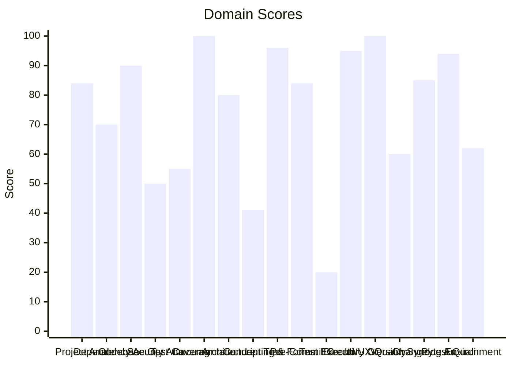

# 🔬 Code Enhancement Report

> **Generated**: 2026-05-01 00:58:13 UTC | **Target**: agent-webui | **Overall GPA**: 2.35/4.0

---

## 📊 Executive Summary

| Domain | Grade | Score | Status |
|--------|-------|-------|--------|
| Test Execution | 🔴 F | 20/100 | `████░░░░░░░░░░░░░░░░` 20/100 |
| Concept Traceability | 🔴 F | 41/100 | `████████░░░░░░░░░░░░` 41/100 |
| Security Analysis | 🔴 F | 50/100 | `██████████░░░░░░░░░░` 50/100 |
| Test Coverage | 🔴 F | 55/100 | `███████████░░░░░░░░░` 55/100 |
| Version Sync Analysis | 🟠 D | 60/100 | `████████████░░░░░░░░` 60/100 |
| Environment Variables | 🟠 D | 62/100 | `████████████░░░░░░░░` 62/100 |
| Dependency Audit | 🟡 C | 70/100 | `██████████████░░░░░░` 70/100 |
| Architecture & Design Patterns | 🔵 B | 80/100 | `████████████████░░░░` 80/100 |
| Project Analysis | 🔵 B | 84/100 | `████████████████░░░░` 84/100 |
| Pre-Commit Compliance | 🔵 B | 84/100 | `████████████████░░░░` 84/100 |
| Changelog Audit | 🔵 B | 85/100 | `█████████████████░░░` 85/100 |
| Codebase Optimization | 🟢 A | 90/100 | `██████████████████░░` 90/100 |
| Pytest Quality | 🟢 A | 94/100 | `██████████████████░░` 94/100 |
| Directory Organization | 🟢 A | 95/100 | `███████████████████░` 95/100 |
| Linting & Formatting | 🟢 A | 96/100 | `███████████████████░` 96/100 |
| Documentation & Governance | 🟢 A | 100/100 | `████████████████████` 100/100 |
| UI/UX Quality | 🟢 A | 100/100 | `████████████████████` 100/100 |

---

## 📋 Domain Scorecards

### Project Analysis — 🔵 Grade: B (84/100)

`████████████████░░░░` 84/100

> [!NOTE]
> Detected ecosystem marker: pydantic-ai → Pydantic-AI Agent

| Criterion | Points | Evidence | Reasoning |
|-----------|--------|----------|-----------|
| has_pyproject | 10 | `pyproject.toml and requirements.txt` | Both pyproject.toml and requirements.txt exist, fulfilling mandatory Python proj |
| project_type_detected | 10 | `Pydantic-AI Agent, Pydantic-AI Agent, Web Agent / API, Agent` | Identified 4 ecosystem marker(s) in dependencies |
| externalized_prompts | 0 | `/home/apps/workspace/agent-packages/agent-webui` | No prompts/ directory found. Prompts may be hardcoded in source. |
| observability | 10 | `logfire, opentelemetry` | Observability/telemetry dependencies detected |
| testing_suite | 10 | `tests dir: True, pytest dep: True` | Tests directory exists, pytest in dependencies |
| agents_md | 10 | `/home/apps/workspace/agent-packages/agent-webui/AGENTS.md (7` | AGENTS.md exists with comprehensive content |
| pre_commit_hooks | 10 | `/home/apps/workspace/agent-packages/agent-webui/.pre-commit-` | Pre-commit configuration found for automated code quality checks |
| gitignore | 10 | `/home/apps/workspace/agent-packages/agent-webui/.gitignore` | .gitignore exists to prevent committing build artifacts and secrets |
| env_template | 10 | `/home/apps/workspace/agent-packages/agent-webui/.env.example` | Environment template exists for onboarding and secret management |
| protocol_support | 4 | `MCP` | 1 communication protocol(s) detected |

**Findings:**
- Detected ecosystem marker: pydantic-ai-slim → Pydantic-AI Agent
- Detected ecosystem marker: fastapi → Web Agent / API
- Detected ecosystem marker: agent-utilities → Agent-Utilities Ecosystem
- Observability integration: logfire, opentelemetry

---

### Dependency Audit — 🟡 Grade: C (70/100)

`██████████████░░░░░░` 70/100

> [!NOTE]
> MAJOR update: starlette 0.50.0 (installed) -> 1.0.0

| Criterion | Points | Evidence | Reasoning |
|-----------|--------|----------|-----------|
| dependency_freshness | 70 | `source=/home/apps/workspace/agent-packages/agent-webui/pypro` | Audited 17 deps (17 installed, 0 constraint-only). 1 major, 6 minor, 2 patch upd |

**Findings:**
- Minor update: sse-starlette 3.0.3 (installed) -> 3.4.1
- Minor update: uvicorn 0.38.0 (installed) -> 0.46.0
- Minor update: pydantic-ai 1.83.0 (installed) -> 1.88.0
- Minor update: opentelemetry-instrumentation-starlette 0.60b1 (installed) -> 0.62b1

---

### Codebase Optimization — 🟢 Grade: A (90/100)

`██████████████████░░` 90/100

> [!TIP]
> Monolithic: api_extensions.py (1670L) — Low cohesion: 69 distinct concepts in one file; 68 public functions — consider grouping into modules

| Criterion | Points | Evidence | Reasoning |
|-----------|--------|----------|-----------|
| code_quality | 90 | `{"file_count": 11, "total_lines": 4240, "function_count": 21` | Analyzed 11 files, 218 functions. Avg CC=2.9, max length=119, duplication=0.3%,  |

---

### Security Analysis — 🔴 Grade: F (50/100)

`██████████░░░░░░░░░░` 50/100

> [!CAUTION]
> 4 MEDIUM severity vulnerabilities found

| Criterion | Points | Evidence | Reasoning |
|-----------|--------|----------|-----------|
| security_posture | 50 | `high=0 med=4 low=6 attack_surface={"subprocess_calls": 0, "f` | Scanned 20 files. Found 10 security findings. High: -0pts, Med: -32pts, Low: -18 |

---

### Test Coverage — 🔴 Grade: F (55/100)

`███████████░░░░░░░░░` 55/100

> [!CAUTION]
> Low test-to-source ratio: 0.02

| Criterion | Points | Evidence | Reasoning |
|-----------|--------|----------|-----------|
| test_coverage_quality | 55 | `{"test_file_count": 1, "test_count": 2, "source_file_count":` | 2 tests across 1 files. Ratio: 0.02. Intent: {'unit': 2}. 1 without assertions,  |

**Findings:**
- Test suite lacks intent diversity (only one type)
- 21 potential doc-test drift items

---

### Documentation & Governance — 🟢 Grade: A (100/100)

`████████████████████` 100/100

> [!TIP]
> README missing: References /docs directory material

| Criterion | Points | Evidence | Reasoning |
|-----------|--------|----------|-----------|
| documentation_quality | 100 | `{"README.md": {"exists": true, "missing": []}, "AGENTS.md": ` | Audited 6 standard docs + docs/ directory. 0 broken references, 5 docs present.  |

---

### Architecture & Design Patterns — 🔵 Grade: B (80/100)

`████████████████░░░░` 80/100

> [!NOTE]
> SRP: 4 modules exceed 500 lines (god modules)

| Criterion | Points | Evidence | Reasoning |
|-----------|--------|----------|-----------|
| architecture_quality | 80 | `{"layers": 4, "di_ratio": 0.0, "solid_violations": 2}` | Analyzed 20 files. 4/5 architecture layers present, DI ratio: 0%, 2 SOLID violat |

**Findings:**
- SRP: 2 classes have >15 methods
- Low dependency injection ratio: 0%

---

### Concept Traceability — 🔴 Grade: F (41/100)

`████████░░░░░░░░░░░░` 41/100

> [!CAUTION]
> Low traceability ratio: 0% concepts fully traced

| Criterion | Points | Evidence | Reasoning |
|-----------|--------|----------|-----------|
| concept_traceability | 41 | `{"total_concepts": 6, "well_traced": 0, "orphans": 6, "drift` | 6 unique concepts found. 0 fully traced (code+docs+tests), 6 orphans, 0 drifted. |

**Findings:**
- 6 orphaned concepts (only in one source)
- 2 test functions missing concept markers
- 72 significant functions (>10 lines) missing concept markers in docstrings

---

### Linting & Formatting — 🟢 Grade: A (96/100)

`███████████████████░` 96/100

> [!TIP]
> Total lint findings: 2 (high/error: 0, medium/warning: 2, low: 0)

| Criterion | Points | Evidence | Reasoning |
|-----------|--------|----------|-----------|
| lint_compliance | 96 | `ruff=0, bandit=0, mypy=2` | 2 total findings across 3 tools. High/error: -0pts, Med/warning: -4pts, Low: -0p |

---

### Pre-Commit Compliance — 🔵 Grade: B (84/100)

`████████████████░░░░` 84/100

> [!NOTE]
> 2/21 pre-commit hooks failed: don't commit to branch, uv-lock

| Criterion | Points | Evidence | Reasoning |
|-----------|--------|----------|-----------|
| precommit_compliance | 84 | `{"total_hooks": 21, "passed": 18, "failed": 2, "skipped": 1,` | Ran pre-commit with 21 hooks: 18 passed, 2 failed, 1 skipped. 2 potentially outd |

**Findings:**
- 2 hook(s) may be outdated: ruff-pre-commit, uv-pre-commit
- Pytest hooks skipped (handled by CE-016 Test Execution): local-pytest, pytest

---

### Test Execution — 🔴 Grade: F (20/100)

`████░░░░░░░░░░░░░░░░` 20/100

> [!CAUTION]
> No tests were executed (test framework detected but no tests found)

| Criterion | Points | Evidence | Reasoning |
|-----------|--------|----------|-----------|
| test_execution | 20 | `{"frameworks_detected": 2, "total_passed": 0, "total_failed"` | Executed 2 framework(s). 0 passed, 0 failed, 1 errors. Pass rate: 0%. |

**Findings:**
- 1 test execution error(s)

---

### Directory Organization — 🟢 Grade: A (95/100)

`███████████████████░` 95/100

> [!TIP]
> 1 directories with >20 files: src/components/ui

| Criterion | Points | Evidence | Reasoning |
|-----------|--------|----------|-----------|
| directory_organization | 95 | `{"total_source_files": 160, "total_directories": 25, "max_de` | 160 files across 25 directories. Max depth: 4, avg files/dir: 6.4. 1 crowded, 0  |

---

### UI/UX Quality — 🟢 Grade: A (100/100)

`████████████████████` 100/100

| Criterion | Points | Evidence | Reasoning |
|-----------|--------|----------|-----------|
| ui_heuristics_web | 100 | `{"ui_type": "web", "files_analyzed": 109, "heuristics_passed` | WEB UI detected. 10/10 Nielsen heuristics pass. Analyzed 109 web files. |

---

### Version Sync Analysis — 🟠 Grade: D (60/100)

`████████████░░░░░░░░` 60/100

> [!WARNING]
> Found 2 file(s) with version '0.2.0' that are NOT tracked in .bumpversion.cfg:

| Criterion | Points | Evidence | Reasoning |
|-----------|--------|----------|-----------|
| bumpversion_exists | 20 | `/home/apps/workspace/agent-packages/agent-webui/.bumpversion` | .bumpversion.cfg found |
| current_version_defined | 20 | `0.2.0` | Current version tracked is 0.2.0 |
| files_tracked | 20 | `4 files tracked` | Found 4 files tracked in .bumpversion.cfg |
| version_drift_check | 0 | `2 untracked files` | Version definitions found in codebase that are missing from .bumpversion.cfg |

**Findings:**
-   - .specify/reports/results.json
-   - .specify/reports/code_enhancement_report.md

---

### Changelog Audit — 🔵 Grade: B (85/100)

`█████████████████░░░` 85/100

> [!NOTE]
> Version drift: pyproject.toml=0.2.0 vs CHANGELOG.md=1.1.0

| Criterion | Points | Evidence | Reasoning |
|-----------|--------|----------|-----------|
| changelog_quality | 85 | `{"exists": true, "parseable": true, "version_count": 2, "has` | CHANGELOG.md exists. 2 versions tracked. Version drift detected. 0 dependency ch |

**Findings:**
- No changelog entries within the last 30 days

---

### Pytest Quality — 🟢 Grade: A (94/100)

`██████████████████░░` 94/100

> [!TIP]
> 1 tests have no assertions

| Criterion | Points | Evidence | Reasoning |
|-----------|--------|----------|-----------|
| pytest_quality | 94 | `{"test_files": 1, "total_tests": 2, "descriptive_name_ratio"` | 2 tests across 1 files. Naming: 20/20, Structure: 20/20, Fixtures: 16/20, Assert |

---

### Environment Variables — 🟠 Grade: D (62/100)

`████████████░░░░░░░░` 62/100

> [!WARNING]
> Only 4% of env vars documented in README.md

| Criterion | Points | Evidence | Reasoning |
|-----------|--------|----------|-----------|
| env_var_documentation | 62 | `{"total_vars": 23, "python_vars": 8, "dockerfile_vars": 0, "` | Found 23 unique env vars across 35 occurrences. README documents 1/23. Has .env. |

**Findings:**
- Undocumented env vars: AGENT_NAME, AGENT_WORKSPACE, ANTHROPIC_API_KEY, BASE_URL, DATABASE_PATH, GOOGLE_API_KEY, GRAPH_BACKEND, GRAPH_DB_PATH, GROQ_API_KEY, LANGFUSE_HOST
- 4 Python env vars not in .env.example: GRAPH_BACKEND, GRAPH_DB_PATH, OLLAMA_BASE_URL, OLLAMA_HOST

---

## 🎯 Prioritized Action Items

| # | Priority | Domain | Action | Impact | Risk |
|---|----------|--------|--------|--------|------|
| 1 | 🔴 High | Security Analysis | 4 MEDIUM severity vulnerabilities found | High | High |
| 2 | 🔴 High | Test Coverage | Low test-to-source ratio: 0.02 | High | High |
| 3 | 🔴 High | Test Coverage | Test suite lacks intent diversity (only one type) | High | High |
| 4 | 🔴 High | Test Coverage | 21 potential doc-test drift items | High | High |
| 5 | 🔴 High | Concept Traceability | Low traceability ratio: 0% concepts fully traced | High | High |
| 6 | 🔴 High | Concept Traceability | 6 orphaned concepts (only in one source) | High | High |
| 7 | 🔴 High | Concept Traceability | 2 test functions missing concept markers | High | High |
| 8 | 🔴 High | Concept Traceability | 72 significant functions (>10 lines) missing concept markers in docstrings | High | High |
| 9 | 🔴 High | Test Execution | No tests were executed (test framework detected but no tests found) | High | High |
| 10 | 🔴 High | Test Execution | 1 test execution error(s) | High | High |
| 11 | 🔴 High | Version Sync Analysis | Found 2 file(s) with version '0.2.0' that are NOT tracked in .bumpversion.cfg: | High | Medium |
| 12 | 🔴 High | Version Sync Analysis |   - .specify/reports/results.json | High | Medium |
| 13 | 🔴 High | Version Sync Analysis |   - .specify/reports/code_enhancement_report.md | High | Medium |
| 14 | 🔴 High | Environment Variables | Only 4% of env vars documented in README.md | High | Medium |
| 15 | 🔴 High | Environment Variables | Undocumented env vars: AGENT_NAME, AGENT_WORKSPACE, ANTHROPIC_API_KEY, BASE_URL, | High | Medium |
| 16 | 🔴 High | Environment Variables | 4 Python env vars not in .env.example: GRAPH_BACKEND, GRAPH_DB_PATH, OLLAMA_BASE | High | Medium |
| 17 | 🟡 Medium | Dependency Audit | MAJOR update: starlette 0.50.0 (installed) -> 1.0.0 | Medium | Low |
| 18 | 🟡 Medium | Dependency Audit | Minor update: sse-starlette 3.0.3 (installed) -> 3.4.1 | Medium | Low |
| 19 | 🟡 Medium | Dependency Audit | Minor update: uvicorn 0.38.0 (installed) -> 0.46.0 | Medium | Low |
| 20 | 🟡 Medium | Dependency Audit | Minor update: pydantic-ai 1.83.0 (installed) -> 1.88.0 | Medium | Low |
| 21 | 🟡 Medium | Dependency Audit | Minor update: opentelemetry-instrumentation-starlette 0.60b1 (installed) -> 0.62 | Medium | Low |
| 22 | 🟡 Medium | Dependency Audit | Minor update: opentelemetry-instrumentation-fastapi 0.60b1 (installed) -> 0.62b1 | Medium | Low |
| 23 | 🟡 Medium | Dependency Audit | Minor update: opentelemetry-instrumentation-asgi 0.60b1 (installed) -> 0.62b1 | Medium | Low |
| 24 | 🟢 Low | Project Analysis | Detected ecosystem marker: pydantic-ai → Pydantic-AI Agent | Low | Low |
| 25 | 🟢 Low | Project Analysis | Detected ecosystem marker: pydantic-ai-slim → Pydantic-AI Agent | Low | Low |
| 26 | 🟢 Low | Project Analysis | Detected ecosystem marker: fastapi → Web Agent / API | Low | Low |
| 27 | 🟢 Low | Project Analysis | Detected ecosystem marker: agent-utilities → Agent-Utilities Ecosystem | Low | Low |
| 28 | 🟢 Low | Project Analysis | Observability integration: logfire, opentelemetry | Low | Low |
| 29 | 🟢 Low | Project Analysis | Protocol support: MCP | Low | Low |
| 30 | 🟢 Low | Architecture & Design Patterns | SRP: 4 modules exceed 500 lines (god modules) | Low | Low |

---

## 🔄 SDD Handoff

Run `generate_sdd_handoff.py` with this report's JSON data to produce
structured TODO items compatible with the `spec-generator` → `task-planner` →
`sdd-implementer` pipeline. Output will be saved to `.specify/specs/`.
