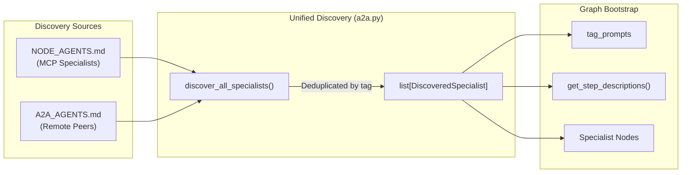

# Agent WebUI


_Version: 0.1.33_

A React-based chat interface for Pydantic AI Agents built using Agent Utilities.

Built with [Vercel AI SDK](https://sdk.vercel.ai/) and designed to work with Pydantic AI's streaming chat API.

## Features

- Streaming message responses with reasoning display
- Tool call visualization with collapsible input/output
- Interactive Elicitation Forms for structured user input
- Conversation persistence via localStorage and server-side storage
- Dynamic model and tool selection
- Dark/light theme support
- Mobile-responsive sidebar
- Scheduling jobs
- Memory
- MCP Support
- Multi-model support
- Graph Activity Visualization -- real-time specialist tracking with domain routing, parallel execution status, tool calls, and expert reasoning displayed in a collapsible timeline (`GraphActivity.tsx`)
- Human-in-the-loop tool approval -- security-sensitive tool calls are intercepted and require explicit user permission via an inline approval card (`ApprovalCard.tsx`)
- Multi-modal support -- image attachments can be sent alongside text messages for visual reasoning
- Mermaid diagram rendering via [Streamdown](https://github.com/nichochar/streamdown)
- Agent identity display in sidebar with workspace-aware context
- Workspace management views:
  - **Files** -- browse and manage workspace files
  - **Skills** -- view and configure universal skills
  - **Scheduling** -- monitor and manage cron tasks
  - **Configuration** -- adjust agent and workspace settings
  - **Knowledge** -- manage knowledge base and embeddings

## Architecture

### Protocol Support

- **AG-UI (default)**: Standard Vercel AI SDK streaming via `/api/chat`. Supports text, reasoning, tool calls, and graph sideband events. Uses the `@ai-sdk/react` `useChat` hook for real-time streaming.
- **ACP (opt-in)**: Advanced Agent Communication Protocol via `/acp/*`. Provides session management, planning modes, and approval bridges. Enabled by setting `VITE_ENABLE_ACP=true`. Routes through the full HSM graph pipeline via `create_graph_acp_app()`, ensuring ACP clients benefit from specialist routing, parallel execution, circuit breakers, and verification.

### Backend Integration

The backend (`agent/agent_webui/server.py`) creates a FastAPI application via `create_agent_web_app()` that:

1. Mounts Pydantic AI's web routes for `/api/chat` (model selection, tool configuration, streaming)
2. Provides enhanced workspace APIs at `/api/enhanced/*` (file operations, chat persistence, cron monitoring, skill management)
3. Serves the built React SPA with client-side routing support via a custom `SPAStaticFiles` handler
4. Integrates Logfire for real-time observability
5. Uses **unified specialist discovery** (`discover_all_specialists()`) at graph bootstrap, merging MCP agents and A2A peers into a single `DiscoveredSpecialist` roster before graph initialization

ACP requests route through the full HSM graph pipeline, ensuring ACP clients share the same specialist routing, parallel execution, and verification logic as AG-UI and SSE clients.

### Unified Discovery Architecture



Both MCP and A2A specialists are registered through the same code path. The frontend does not need to distinguish between them -- it consumes identical sideband events (`specialist_enter`, `tools-bound`, `subagent_completed`) regardless of specialist source.

### Key Frontend Components

| Component                     | Purpose                                                                                                              |
| ----------------------------- | -------------------------------------------------------------------------------------------------------------------- |
| `Chat.tsx`                    | Main chat interface with streaming, tool execution, graph activity, multi-modal input, and approval workflows        |
| `GraphActivity.tsx`           | Real-time graph execution timeline showing routing decisions, parallel execution, tool binding, and expert reasoning |
| `ApprovalCard.tsx`            | Human-in-the-loop tool approval card for security-sensitive operations                                               |
| `Part.tsx`                    | Message part renderer handling text, tool calls, elicitation forms, sources, and images                              |
| `app-sidebar.tsx`             | Navigation sidebar with conversation history, agent identity, and view switching                                     |
| `views/FilesView.tsx`         | Workspace file browser with upload and download                                                                      |
| `views/SkillsView.tsx`        | Universal skills viewer and configuration                                                                            |
| `views/SchedulingView.tsx`    | Cron task monitoring and management                                                                                  |
| `views/ConfigurationView.tsx` | Agent and workspace configuration                                                                                    |
| `views/KnowledgeView.tsx`     | Knowledge base and embedding management                                                                              |
| `acp-client.ts`               | ACP protocol client for session management, RPC calls, and SSE event streaming                                       |

### State Management

- **Server state**: React Query (`@tanstack/react-query`) for workspace data, conversations, and configuration
- **Chat state**: Vercel AI SDK `useChat` hook for message streaming and tool execution
- **Client state**: React Context and local component state
- **Persistence**: localStorage for conversation IDs and preferences, server-side via `/api/enhanced/chats`

## Development

```sh
pnpm install
pnpm run dev:server  # start the Python backend (requires agent/ setup)
pnpm run dev         # start the Vite dev server
```

### Environment Variables

| Variable          | Default | Description                                 |
| ----------------- | ------- | ------------------------------------------- |
| `VITE_ENABLE_ACP` | `false` | Enable ACP protocol support alongside AG-UI |

## License

MIT
