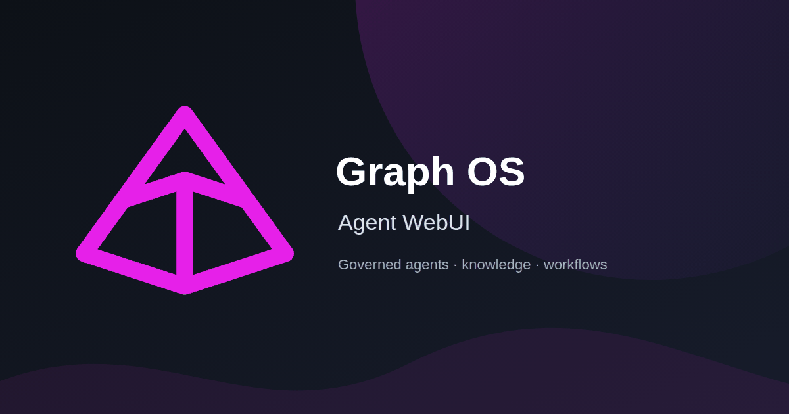
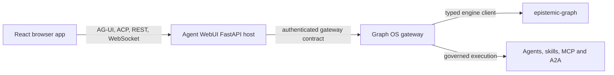

# Agent WebUI

[](https://github.com/Knuckles-Team/agent-webui/actions/workflows/release.yml)
[](https://knuckles-team.github.io/agent-webui/)
[](https://pypi.org/project/agent-webui/)
[](https://pypi.org/project/agent-webui/)
[](https://github.com/Knuckles-Team/agent-webui/stargazers)
[](https://github.com/Knuckles-Team/agent-webui/forks)
[](https://github.com/Knuckles-Team/agent-webui/graphs/contributors)
[](https://pypi.org/project/agent-webui/)
[](LICENSE)
[](https://github.com/Knuckles-Team/agent-webui/commits/main/)
[](https://github.com/Knuckles-Team/agent-webui/pulls)
[](https://github.com/Knuckles-Team/agent-webui/pulls?q=is%3Apr+is%3Aclosed)
[](https://github.com/Knuckles-Team/agent-webui/issues)
[](https://github.com/Knuckles-Team/agent-webui)
[](https://github.com/Knuckles-Team/agent-webui)
[](https://github.com/Knuckles-Team/agent-webui)
[](https://github.com/Knuckles-Team/agent-webui)
[](https://pypi.org/project/agent-webui/#files)
[](https://pypi.org/project/agent-webui/)



## Overview

Agent WebUI is the browser interface for Graph OS. It combines streaming agent chat,
governed tool use, live graph activity, knowledge exploration, and operational
views in one responsive React application. A FastAPI serving layer hosts the
built application, adapts browser protocols, and composes the authoritative
Graph OS gateway surface. Current package Version: 2.6.0.

[Read the documentation](https://knuckles-team.github.io/agent-webui/) ·
[Explore the architecture](https://knuckles-team.github.io/agent-webui/architecture/)
·
[View the feature reference](https://knuckles-team.github.io/agent-webui/features/)

## Key capabilities

- **Streaming agent workspace** — text, reasoning, sources, tool calls, attachments,
  elicitation forms, and human approval in a single conversation timeline.
- **Live orchestration visibility** — specialist routing, parallel work, tool binding,
  verification, and completion events rendered as they happen.
- **Atlas knowledge workspace** — guided and expert paths for documents, memories,
  graph data, code intelligence, object sets, and tables.
- **Ontology operator tools** — search, pivot, aggregate, edit, and inspect typed
  objects while preserving authorization, provenance, and history.
- **Governed MCP Apps** — same-origin tool delegation and sandboxed `ui://` resources;
  credentials and service authority never enter the browser.
- **Operational surfaces** — agents, skills, workflows, schedules, services, files,
  configuration, observability, and deployment state.
- **Multiple client protocols** — AG-UI streaming by default and optional ACP sessions,
  both using the same orchestration path.

The full view and endpoint inventories live in the
[feature reference](https://knuckles-team.github.io/agent-webui/features/), not
in this entry page.

## Architecture



The boundaries are intentional:

- **Agent WebUI owns presentation and browser-safe protocol adaptation.**
- **Graph OS owns authentication, composition, routing, and public gateway contracts.**
- **epistemic-graph owns durable graph state, queries, reasoning, and evidence.**
- **Agent Utilities owns agent and workflow control-plane behavior.**

The WebUI does not create a second graph authority, connector runtime, or scheduler.
Browser requests reuse the gateway's canonical routes, and privileged MCP
operations are performed only through host-injected, audited delegation ports.
See the
[architecture guide](https://knuckles-team.github.io/agent-webui/architecture/)
for the protocol and component maps.

## Quick start

Agent WebUI is published as a Python package and in its own container image for
Graph OS deployments. Python 3.12–3.14 is supported.

```bash
python -m venv .venv
source .venv/bin/activate
python -m pip install agent-webui
```

The wheel is a composable frontend/serving component. A complete deployment
also needs compatible Graph OS, Agent Utilities, and epistemic-graph services.
Follow the
[deployment guide](https://knuckles-team.github.io/agent-webui/deployment/)
rather than assembling those services from unpinned packages.

## Development

Prerequisites: Python 3.12+, Node.js (the version in `.node-version`), `pnpm`,
and `uv`.

```bash
git clone https://github.com/Knuckles-Team/agent-webui.git
cd agent-webui

pnpm install --frozen-lockfile
uv venv --python 3.12
source .venv/bin/activate
uv pip install -e '.[test]'
cp .env.example .env
```

Start the backend and frontend in separate terminals:

```bash
pnpm run dev:server

pnpm run dev
```

The example environment file documents provider and development settings. Never
commit `.env` or raw credentials. Remote serving is fail-closed: it requires an
explicit host allowlist and a verified JWT/OIDC configuration. Run the security
doctor before exposing the service:

```bash
python -m agent_webui.server --security-doctor --host 0.0.0.0
```

See
[Deployment and operations](https://knuckles-team.github.io/agent-webui/deployment/)
for the complete security boundary, image workflow, Kubernetes contract, and
rollback procedure.

## Test and build

```bash
pnpm run typecheck       # TypeScript
pnpm run lint            # ESLint
pnpm run test            # Vitest
pnpm run test:e2e        # Playwright
pnpm run build           # production frontend + packaged assets

uv run --all-extras pytest agent/agent_webui/__tests__
pre-commit run --all-files
```

## Deploy

Use the repository-owned deployment script:

```bash
docker/deploy.sh
```

Useful non-deploying modes are:

```bash
docker/deploy.sh --build-only
docker/deploy.sh --skip-deploy
```

Do not substitute an ad hoc image build or a rollout restart. Production is
deployed by immutable image digest, and the live-mounted frontend bundle must be
updated alongside the backend. The script performs both checks and prints a
rollback digest before making changes. The
[deployment guide](https://knuckles-team.github.io/agent-webui/deployment/)
contains the full operator contract.

## Documentation

- [Documentation home](https://knuckles-team.github.io/agent-webui/)
- [Architecture and protocols](https://knuckles-team.github.io/agent-webui/architecture/)
- [Agents and graph events](https://knuckles-team.github.io/agent-webui/agents/)
- [Atlas knowledge workspace](https://knuckles-team.github.io/agent-webui/atlas/)
- [Capability Workbench](https://knuckles-team.github.io/agent-webui/capability-workbench/)
- [Ecosystem integration](https://knuckles-team.github.io/agent-webui/ecosystem/)
- [Deployment and operations](https://knuckles-team.github.io/agent-webui/deployment/)

## Contributing

Issues and pull requests are welcome. Before submitting a change, run the
relevant frontend or backend tests followed by `pre-commit run --all-files`.
Keep public examples free of credentials, private endpoints, machine-specific
paths, and operational data.

## License

Agent WebUI is available under the [MIT License](LICENSE).
