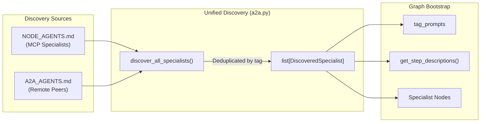

# Agent WebUI


_Version: 2.0.0_

> **Documentation** — The architecture, graph-activity event model, feature surface,
> and ecosystem integration of Agent WebUI are maintained in the
> [official documentation](https://knuckles-team.github.io/agent-webui/), which
> presents the project's reference material as a searchable, published site.

A React-based chat interface for Pydantic AI Agents built using Agent Utilities.

Built with [Vercel AI SDK](https://sdk.vercel.ai/) and designed to work with Pydantic AI's streaming chat API.

## Overview

Agent WebUI is a highly interactive, responsive chat interface designed specifically for complex agentic workflows. It visualizes background reasoning, renders tool invocations, and provides a real-time sideband view of parallel multi-agent graph execution.

## Table of Contents

- [Overview](#overview)
- [Features](#features)
- [Architecture](#architecture)
- [Installation](#installation)
- [Usage](#usage)
- [Development](#development)
- [Detailed Documentation](#detailed-documentation)
- [Documentation](#documentation)
- [License](#license)

## Features

### Core Chat Experience
- Streaming message responses with reasoning display
- Tool call visualization with collapsible input/output
- Interactive Elicitation Forms for structured user input
- Conversation persistence via localStorage and server-side storage
- Dynamic model and tool selection
- Dark/light theme support
- Mobile-responsive sidebar

### Advanced Agent Capabilities
- Scheduling jobs with cron task monitoring
- Memory management with timeline visualization and importance scoring
- MCP Support with unified specialist discovery
- Multi-model support with dynamic routing
- Multi-modal support -- image attachments can be sent alongside text messages for visual reasoning
- Mermaid diagram rendering via [Streamdown](https://github.com/nichochar/streamdown)

### Graph Orchestration & Visualization
- **Graph Activity Visualization** -- real-time specialist tracking with domain routing, parallel execution status, tool calls, and expert reasoning displayed in a collapsible timeline (`GraphActivity.tsx`)
- **Enhanced GraphView** -- interactive graph visualization with:
  - Force-directed, hierarchical, and circular layout algorithms
  - Zoom/pan controls and PNG export
  - Node type filtering and detailed node inspection
  - Real-time graph statistics and relationship explorer
- **Code Graph Navigator** (`CodeGraphView.tsx`, CONCEPT:AU-KG.backend.declared-columns-so-schema) -- navigate the
  resolved code-symbol graph built from your indexed GitLab instances: find a
  symbol's **definition**, its **references** (callers), trace the transitive
  **call graph**, or compute the **impact** (blast radius) of a change — scoped to
  one `source_system` (a GitLab tenant) or unioned across all. Backed by the
  `/api/enhanced/code/nav` route over the canonical `graph_code_nav` query contract.
- **Human-in-the-loop tool approval** -- security-sensitive tool calls are intercepted and require explicit user permission via an inline approval card (`ApprovalCard.tsx`)

### Knowledge Management
- **Knowledge Base Management** -- comprehensive KB system with:
  - Document ingestion from workspace-confined sources; remote URLs require a governed ingestion connector
  - Article CRUD with concept extraction and fact indexing
  - Health check monitoring with contradiction detection
  - Hybrid search across knowledge bases
- **Memory Management** -- agent memory system with:
  - Timeline visualization of memory creation and updates
  - Importance scoring and temporal decay tracking
  - Tag-based organization and advanced search
  - Impact analysis for code changes
- **Brain & Knowledge Orthogonal Views** -- policy-guided retrieval across:
  - Semantic view (vector-based similarity)
  - Temporal view (episodic memory with decay)
  - Causal view (reasoning traces and "why" links)
  - Entity view (people, organizations, code symbols)

### Ontology Operator Views

Three operator views surface the `agent-utilities` ontology system (`kg.ontology`) directly in the UI. All data is fetched live (no fixtures) through the `/api/enhanced/ontology/*` backend routes, which resolve against the same `IntelligenceGraphEngine` backend the rest of the app uses and enforce the fine-grained permissioning gate (`kg.ontology.permissioning.enforce`).

- **Object Explorer** (`ObjectExplorerView.tsx`) -- faceted/full-text search and property filters over object sets, with a results table, pivot across a link type, search-around (related objects N hops away), aggregate metrics (count/sum/avg/min/max, optionally grouped), bulk Actions on a row selection (run through the governed `ActionExecutor` with Edit-Ledger writeback and HITL approval for high-risk verbs), and save/list of object sets.
- **Object View renderer** (`ObjectView.tsx`) -- renders a single ontology object as the central hub: value-type-aware properties, computed derived properties (visually distinguished), in/out links grouped by link type and navigable, marking/permission badges, a bitemporal edit-history timeline, and inline edit/revert affordances. Two form factors via `variant` (`full` page, `panel` embeddable) and two layout sources via `layout` (`standard`, derived from the object type's interface schema; `configured`, a stored widget composition).
- **Vertex scenario view** (`VertexView.tsx`) -- a graph-canvas exploration over an object-set seed with link-type expansion (search-around), per-node derived-property computation, and a what-if scenario mode: remove nodes from the working set, recompute an aggregate scenario metric against the reduced id set, and compare it to the unmodified baseline (delta).

#### `/api/enhanced/ontology/*` backend routes

Defined in `agent/agent_webui/api_extensions.py`:

| Method & path | Purpose |
| ------------- | ------- |
| `GET /ontology/object-types` | Distinct object/node types (registry types + interface implementers) |
| `GET /ontology/property-types` | Property-type registry (KG-2.47) |
| `GET /ontology/interfaces` | Interfaces with their implementers (KG-2.38) |
| `GET /ontology/interfaces/{name}/implementers` | Implementers of a single interface |
| `POST /ontology/object-set/search` | Resolve an object set by ids / kind / property filters / query |
| `POST /ontology/object-set/search-around` | Related objects N hops from a seed set |
| `POST /ontology/object-set/pivot` | Pivot an object set across a link type, grouped |
| `POST /ontology/object-set/aggregate` | Aggregate (count/sum/avg/min/max), optionally grouped |
| `POST /ontology/object-set/save` | Persist a named/saved object set |
| `GET /ontology/object-set/list` | List saved object sets |
| `GET /ontology/actions` | Registered `OntologyAction`s, optionally scoped to a type |
| `POST /ontology/object-set/action` | Apply a bulk action via the governed executor (writeback + HITL approve) |
| `GET /ontology/object/{object_id}` | Full object view: properties, links, derived, markings, history, layout |
| `POST /ontology/object/{object_id}/edit` | Record a durable edit (property_set / link_add / link_remove) |
| `POST /ontology/object/{object_id}/revert` | Revert an edit via a compensating edit |
| `POST /ontology/function/invoke` | Invoke a typed, versioned ontology function (audited runtime, AU-KG.ontology.default-runtime-bound-import) |
| `POST /ontology/derive` | Compute a single derived property for an object (KG-2.40) |
| `POST /ontology/document/process` | Process a document into Document + Chunk objects (KG-2.48) |
| `GET /ontology/object-view/{object_type}` | Get a type's ObjectView: stored (configured) else standard (schema) |
| `POST /ontology/object-view/{object_type}` | Save a configured ObjectView widget composition for a type |

### Unified Agent Homelab
- **Ecosystem Service Discovery** -- Automatically scans for and lists active/installed local agent packages and MCP servers.
- **5-Domain Navigation Layout**:
  - **DevOps & Workspace**: Workspace Matrix code status, branch operations, and git pulling.
  - **Brain & Knowledge**: Visual SVG graph nodes, Cypher console, scientific literature papers explorer, and Prompts visual configurator.
  - **Infrastructure Hub**: governed SSH/container inventory, CPU/RAM/Disk dials, opaque process utilization, and delegated infrastructure actions.
  - **Lifestyle & Automation**: SmartHome device dimmers, Calendar tasks, qBittorrent torrent speedometers, and MealieScaled grocery trackers.
  - **System Config**: Scheduled crons timeline and Global settings configurator forms.

### Spec-Driven Development (SDD)
- **Constitution Management** -- project governance and tech stack configuration
- **Specification Management** -- user stories, acceptance criteria, and requirements
- **Implementation Planning** -- technical approach with dependency mapping
- **Task Management** -- parallel execution tracking with status updates
- **Memory Synchronization** -- automatic capture of SDD lifecycle to knowledge graph

### Resource Management
- **MCP Tool Discovery** -- automatic discovery and registration of MCP server tools
- **A2A Agent Registry** -- peer-to-peer agent communication and coordination
- **Specialist Spawning** -- dynamic creation of specialized sub-agents with curated toolsets
- **Resource Explorer** -- unified view of all callable resources (MCP tools, A2A agents, skills)

### Workspace Management
- **Files** -- browse and manage workspace files with upload/download
- **Skills** -- view and configure universal skills
- **Scheduling** -- monitor and manage cron tasks
- **Configuration** -- adjust agent and workspace settings
- **Knowledge** -- manage knowledge base and embeddings
- **Graph** -- interactive knowledge graph visualization and exploration
- **Memory** -- agent memory management with timeline and search
- **SDD** -- spec-driven development lifecycle management

### Agent Identity & Context
- Agent identity display in sidebar with workspace-aware context
- Multi-agent team support with P2P messaging
- Workspace-specific configuration and preferences

## Architecture

### Protocol Support

- **AG-UI (default)**: Standard Vercel AI SDK streaming via `/api/chat`. Supports text, reasoning, tool calls, and graph sideband events. Uses the `@ai-sdk/react` `useChat` hook for real-time streaming.
- **ACP (opt-in)**: Advanced Agent Communication Protocol via `/acp/*`. Provides session management, planning modes, and approval bridges. Enabled by setting `VITE_ENABLE_ACP=true`. Routes through the full HSM graph pipeline via `create_graph_acp_app()`, ensuring ACP clients benefit from specialist routing, parallel execution, circuit breakers, and verification.

### Backend Integration & Centralized Gateway

The WebUI backend (`agent/agent_webui/server.py`) integrates with a **Centralized Epistemic Gateway** hosted directly in `agent-utilities` (`agent-utilities-kg`). This gateway centralizes database connections, memory stores, and workspace actions for multiple concurrent agents and client applications.

1. **Vercel AI SDK Integration**: Mounts Pydantic AI's streaming chat routes for `/api/chat`.
2. **Centralized Routing & API Proxy**: Proxy-routes `/api/enhanced/*` dynamically to the Centralized Epistemic Gateway:
   - **Knowledge Graph APIs**: Memory CRUD, node linking, search, impact analysis, Cypher console queries.
   - **Knowledge Base & Ingestion**: Resource parsing, sitemap scanning, literature exploration, hybrid vector search.
   - **SDD Lifecycle APIs**: Constitution, specification matrices, implementation planning, and automatic task/memory sync.
3. **Unified Tools Configuration (Centralized /tools & /tools/toggle)**:
   - Lists and configures all 3 tool classes (MCP Servers, Built-in Tools, Agent Skills/Workflows/Graphs) via standard `/tools` API.
   - Toggles status of individual skills, workflows, graphs, servers, or native tools via `/tools/toggle`, persisting preferences directly inside the Knowledge Graph as `Preference` nodes.
4. **Symmetric Bilateral Graph Execution Routes**:
   - Exposes 7 high-fidelity graph REST routes (`/graph/query`, `/graph/search`, `/graph/write`, `/graph/ingest`, `/graph/analyze`, `/graph/orchestrate`, `/graph/configure`) that map symmetrically to the Knowledge Graph's registered tools, letting external applications execute graph methods as standard HTTP endpoints.
5. **Unified Specialist Discovery**: Consolidates MCP specialists and A2A peers into a single discovered registry at graph boot.
6. **Robust Storage Abstraction**: Utilizes the gateway's optimized engine database connection pooling and backend adapters (LadybugDB, Neo4j).

All communication is fully traceable, logging session parameters, agent identities, and provenance for complete ecosystem visibility.

### MCP client & MCP Apps host

The browser never opens an MCP connection itself. graph-os rejects any request whose `Host`
authority is outside `MCP_ALLOWED_HOSTS` (which a browser cannot set) and authenticates children
with a service bearer no page may hold, so `src/lib/mcp-client.ts` calls the WebUI's own backend
same-origin instead:

| Route | Purpose |
|-------|---------|
| `POST /api/enhanced/mcp/tools/call` | one MCP `tools/call` through the governed delegation seam |
| `POST /api/enhanced/mcp/apps/resource` | one MCP `resources/read` for a `ui://` MCP App |

Both require `kg:admin` (invoking an arbitrary fleet tool is an admin mutation), and both delegate to
the host-injected `call_mcp_tool` / `read_mcp_resource` workspace helpers — supplied by
`agent_utilities.server.webui_mcp_delegation` — which own the allow-list, credentials and audit
envelope. With no host injection they answer `501` rather than building a client of their own.

`McpAppHost` (`src/components/mcp/McpAppHost.tsx`) fetches a `ui://` app's HTML and renders it in
`McpAppFrame`. **Tool-returned HTML is untrusted**: the frame is `sandbox="allow-scripts"` with no
`allow-same-origin` (so the app can never read this origin's document, cookies, storage, or issue a
credentialed request of its own), gets a `no-referrer` policy, and carries a CSP built by
intersecting the server-declared `_meta.ui.csp` against the host's own `allowedDomains` ceiling. Its
tool-call channel is host-mediated `postMessage` only, gated by an `allowedTools` allow-list that
`McpAppHost` requires explicitly — there is no permissive default.

### Unified Discovery Architecture



Both MCP and A2A specialists are registered through the same code path. The frontend does not need to distinguish between them -- it consumes identical sideband events (`specialist_enter`, `tools-bound`, `subagent_completed`) regardless of specialist source.

### Key Frontend Components

| Component                     | File                                         | Responsibility                                                                                            |
| ----------------------------- | -------------------------------------------- | -------------------------------------------------------------------------------------------------------- |
| `Chat.tsx`                    | `src/Chat.tsx`                               | Main chat interface with streaming, tool execution, graph activity, multi-modal input, approval workflows |
| `GraphActivity.tsx`           | `src/components/GraphActivity.tsx`           | Real-time graph execution timeline showing routing decisions, parallel execution, tool binding, and expert reasoning |
| `ApprovalCard.tsx`            | `src/components/ApprovalCard.tsx`            | Human-in-the-loop tool approval card for security-sensitive operations                               |
| `Part.tsx`                    | `src/Part.tsx`                               | Message part renderer handling text, tool calls, elicitation forms, sources, and images              |
| `app-sidebar.tsx`             | `src/components/app-sidebar.tsx`             | Navigation sidebar with conversation history, agent identity, and view switching                     |
| **Graph Views**               |                                              |                                                                                                          |
| `GraphView.tsx`               | `src/components/views/GraphView.tsx`         | Interactive graph visualization with layouts, zoom/pan, node inspection, and statistics                |
| **Knowledge Management**      |                                              |                                                                                                          |
| `KnowledgeBaseView.tsx`       | `src/components/views/KnowledgeBaseView.tsx` | Knowledge base ingestion, article management, health checks, and search                                |
| `MemoryView.tsx`              | `src/components/views/MemoryView.tsx`        | Memory CRUD with timeline visualization, importance scoring, and advanced search                        |
| **Ontology Operator Views**   |                                              |                                                                                                          |
| `ObjectExplorerView.tsx`      | `src/components/views/ObjectExplorerView.tsx` | Object-set search, filters, pivot, search-around, aggregate, bulk Actions, and save/list                |
| `ObjectView.tsx`              | `src/components/views/ObjectView.tsx`        | Single-object hub: properties, derived props, links, markings, edit-history timeline, inline edit/revert |
| `VertexView.tsx`              | `src/components/views/VertexView.tsx`        | Graph-canvas object-set exploration with link expansion and what-if scenario metrics (baseline vs delta) |
| **SDD Lifecycle**             |                                              |                                                                                                          |
| `SDDView.tsx`                 | `src/components/views/SDDView.tsx`          | Spec-driven development: constitution, specs, plans, tasks, and memory synchronization                  |
| **Workspace Views**            |                                              |                                                                                                          |
| `FilesView.tsx`               | `src/components/views/FilesView.tsx`         | Workspace file browser with upload and download                                                         |
| `SkillsView.tsx`              | `src/components/views/SkillsView.tsx`        | Universal skills viewer and configuration                                                              |
| `SchedulingView.tsx`          | `src/components/views/SchedulingView.tsx`    | Cron task monitoring and management                                                                    |
| `ConfigurationView.tsx`       | `src/components/views/ConfigurationView.tsx` | Agent and workspace configuration                                                                      |
| `KnowledgeView.tsx`           | `src/components/views/KnowledgeView.tsx`     | Knowledge base and embedding management (legacy)                                                      |
| **Protocol Clients**          |                                              |                                                                                                          |
| `acp-client.ts`               | `src/lib/acp-client.ts`                      | ACP protocol client for session management, RPC calls, and SSE event streaming                       |
| `mcp-context.tsx`             | `src/lib/mcp-context.tsx`                    | MCP tool context provider for the React tree                                                            |

### State Management

- **Server state**: React Query (`@tanstack/react-query`) for workspace data, conversations, and configuration
- **Chat state**: Vercel AI SDK `useChat` hook for message streaming and tool execution
- **Client state**: React Context and local component state
- **Persistence**: localStorage for conversation IDs and preferences, server-side via `/api/enhanced/chats`

## Installation

Ensure you have [Node.js](https://nodejs.org/) (with `pnpm`) and [Python 3.11+](https://www.python.org/) installed.

```sh
# Clone the repository
git clone https://github.com/pydantic/ai-chat-ui.git
cd ai-chat-ui

# Install frontend dependencies
pnpm install

# Install backend dependencies (in a virtual environment)
cd agent
uv venv
source .venv/bin/activate
uv pip install -e .
cd ..
```

## Usage

Start both the frontend and backend servers to run the interface:

```sh
# Terminal 1: Start the Python backend
pnpm run dev:server

# Terminal 2: Start the Vite frontend dev server
pnpm run dev
```

Navigate to `http://localhost:5173` to interact with the agent.

### Served security boundary

The backend defaults to a loopback-only development boundary. A non-loopback
listener fails closed unless JWT verification has a JWKS URI, issuer, and
audience, and an explicit `ALLOWED_HOSTS` allowlist is configured. Browser
origins are exact `http`/`https` origins; wildcard origins are rejected.

All authenticated routes enforce `kg:read`, `kg:write`, or `kg:admin` from the
server-minted graph session. State-changing tool and skill configuration
requires `kg:admin`; the enhanced raw graph, code, KB, agent, and supervisory
dashboard surfaces are admin-only. API responses are non-cacheable, WebSocket messages and
HTTP request bodies are bounded, and remote KB URLs are not fetched directly
by the WebUI. Route remote ingestion through a host connector that enforces its
own URL, DNS, redirect, credential, timeout, and response-size policy.

Startup also requires a callable
`agent_utilities.security.request_identity.mint_graph_session`; the server will
not fall back to an unscoped identity. Synchronous graph/backend adapters share
a fixed four-worker, eight-slot budget. A request deadline does not release a
slot while an underlying Python call is still running, so repeated timeouts
cannot create unbounded threads or queued work. Saturated and timed-out calls
return `503`; each worker receives the server-minted request identity context.
A backend that can hang indefinitely must additionally enforce a
native operation/socket timeout: its charged slot intentionally remains
unavailable until that backend call exits.

The browser policy defaults to `default-src 'none'`, self-hosted scripts and
styles, no script attributes, no frames, and exact source lists. The only
built-in exceptions are inline React **style attributes** and local
`data:`/`blob:` image sources; the security doctor reports
these explicitly. External previews are disabled until their exact origins are
listed in `AGENT_WEBUI_CSP_FRAME_SOURCES`. Other exact-origin additions use the
corresponding `AGENT_WEBUI_CSP_*_SOURCES` variables below. Wildcards, paths,
credentials, and directive injection are rejected. Custom `html_source`
rendering fails startup unless `AGENT_WEBUI_CSP_CUSTOM_RENDERING=1`; inline
script/style keywords must then be separately and explicitly configured.

The bundled CLI disables Uvicorn access logging because raw query strings can
contain searches, graph symbols, or other sensitive text. A non-loopback app
factory deployment must set `AGENT_WEBUI_ACCESS_LOG_POLICY=disabled` or
`redacted`. `redacted` is an operator attestation, not a logger implementation:
the embedding ASGI server or proxy must remove raw query strings and credentials
before writing access records. Check the active contract with
`python -m agent_webui.server --security-doctor` or the admin-only
`GET /api/enhanced/security/doctor` endpoint. The latter also exposes bounded
sync-work utilization and reports `degraded` while timed-out work still occupies
capacity.

The bundled browser client does not store bearer credentials and the native
WebSocket API cannot attach an `Authorization` header. A remote deployment
therefore needs an authentication-aware same-origin proxy that injects the
verified upstream identity for page, API, and WebSocket requests. Configured
allowed origins authorize request origins; they do not enable CORS response
headers for a separately hosted frontend.

## Development

```sh
pnpm install
pnpm run dev:server  # start the Python backend (requires agent/ setup)
pnpm run dev         # start the Vite dev server
```

### Testing

```sh
# Frontend tests
pnpm run test              # Run unit tests
pnpm run test:coverage     # Run with coverage
pnpm run test:watch        # Watch mode
pnpm run test:e2e          # Run E2E tests with Playwright

# Backend tests
pytest agent/agent_webui/__tests__/              # Run backend tests
pytest agent/agent_webui/__tests__/ --cov        # With coverage
```

### Environment Variables

| Variable | Default | Description |
| --- | --- | --- |
| `VITE_ENABLE_ACP` | `false` | Enable ACP protocol support alongside AG-UI |
| `PERSISTENCE_IDENTITY_HMAC_KEY_REF` | — | Runtime secret reference used for stable, opaque durable identities |
| `AGENT_WEBUI_ACCESS_LOG_POLICY` | loopback-only | Required as `disabled` or `redacted` for a non-loopback listener |
| `AGENT_WEBUI_CSP_CUSTOM_RENDERING` | `false` | Explicitly acknowledge use of a custom `html_source` |
| `AGENT_WEBUI_CSP_SCRIPT_SOURCES` | — | Extra exact script origins or CSP hashes; unsafe keywords also require the custom-rendering acknowledgement |
| `AGENT_WEBUI_CSP_STYLE_SOURCES` | — | Extra exact style origins or CSP hashes, applied to both the fallback and element directives |
| `AGENT_WEBUI_CSP_IMAGE_SOURCES` | — | Extra exact image origins |
| `AGENT_WEBUI_CSP_FONT_SOURCES` | — | Extra exact font origins |
| `AGENT_WEBUI_CSP_CONNECT_SOURCES` | — | Extra exact HTTP(S) or WebSocket API origins |
| `AGENT_WEBUI_CSP_MEDIA_SOURCES` | — | Extra exact media origins |
| `AGENT_WEBUI_CSP_WORKER_SOURCES` | — | Extra exact worker origins |
| `AGENT_WEBUI_CSP_FRAME_SOURCES` | — | Exact origins allowed in the Web Preview iframe; frames are denied when unset |

## Documentation

The complete reference for Agent WebUI is published as a searchable site at the
[official documentation](https://knuckles-team.github.io/agent-webui/). It covers the
[system architecture and protocol flow](https://knuckles-team.github.io/agent-webui/architecture/),
the [agent and graph-activity event model](https://knuckles-team.github.io/agent-webui/agents/),
the [feature surface and API endpoints](https://knuckles-team.github.io/agent-webui/features/),
and the [unified homelab ecosystem integration](https://knuckles-team.github.io/agent-webui/ecosystem/).

## License

MIT
