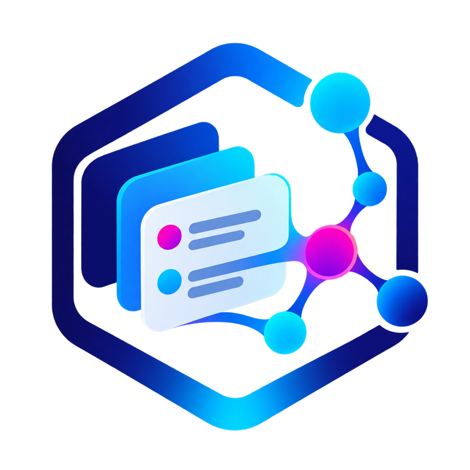

# Agent Web UI

<p align="center">
  
</p>

<p align="center">
  <strong>The browser workspace for governed agents, workflows, and knowledge in Graph OS.</strong><br>
  <sub>Conversations · approvals · workflows · fleet activity · Atlas knowledge views</sub>
</p>

<p align="center">

[](https://pypi.org/project/agent-webui/)
[](https://github.com/Knuckles-Team/agent-webui/actions/workflows/release.yml)
[](https://knuckles-team.github.io/agent-webui/)
[](LICENSE)
[](https://github.com/Knuckles-Team/agent-webui/actions/workflows/advisory.yml)
[](https://pypi.org/project/agent-webui/)
[](https://pypi.org/project/agent-webui/)
[](https://pypi.org/project/agent-webui/)
[](https://pypi.org/project/agent-webui/)
[](https://github.com/Knuckles-Team/agent-webui/stargazers)
[](https://github.com/Knuckles-Team/agent-webui/forks)
[](https://github.com/Knuckles-Team/agent-webui/graphs/contributors)
[](https://github.com/Knuckles-Team/agent-webui/commits/main)
[](https://github.com/Knuckles-Team/agent-webui/pulls)
[](https://github.com/Knuckles-Team/agent-webui/pulls?q=is%3Apr+is%3Aclosed)
[](https://github.com/Knuckles-Team/agent-webui/issues)
[](https://github.com/Knuckles-Team/agent-webui)
[](https://github.com/Knuckles-Team/agent-webui)
[](https://github.com/Knuckles-Team/agent-webui)
[](https://github.com/Knuckles-Team/agent-webui)

</p>

<p align="center">
  <a href="https://knuckles-team.github.io/agent-webui/">Documentation</a> ·
  <a href="https://knuckles-team.github.io/agent-webui/features/">Capabilities</a> ·
  <a href="https://knuckles-team.github.io/agent-webui/architecture/">Interfaces</a> ·
  <a href="https://knuckles-team.github.io/agent-webui/status/">Status</a>
</p>


## Overview

Agent Web UI is the browser workspace composed by Graph OS. It brings agent
conversations, approvals, workflows, fleet activity, and Epistemic Graph
exploration into one React application. Its FastAPI host keeps privileged
credentials and gateway delegation on the server side.

| Agent Web UI owns | Other components own |
|---|---|
| Browser presentation, local interaction state, accessible route composition, and the FastAPI boundary | Graph OS owns public routing, identity, policy, and fleet supervision; Agent Utilities owns agent behavior; Epistemic Graph owns durable knowledge; connector services own external-system effects |

Current package Version: 2.6.2.

## Key capabilities

- Stream agent responses with sources, governed tool activity, and approval prompts.
- Build and run workflows while observing sessions, goals, schedules, and fleet health.
- Explore property graphs, RDF, schemas, objects, tables, documents, code, and memories through Atlas and Epistemic Graph.
- Discover MCP Apps and connector capabilities without exposing service credentials to the browser.
- Apply one role-aware navigation and server authorization model across the complete workspace.
- Run as the Graph OS-hosted browser co-service or as an independently deployed ASGI application.

## Documentation

Start with the [Agent Web UI documentation](https://knuckles-team.github.io/agent-webui/),
then use the shared platform map to move between components:

| Component | Role | Documentation |
|---|---|---|
| Agent Web UI | Browser operator workspace and Atlas knowledge views | [Docs](https://knuckles-team.github.io/agent-webui/) |
| Agent Terminal UI | Terminal and headless client; REST operations are available, with no ACP conversational path | [Docs](https://knuckles-team.github.io/agent-terminal-ui/) |
| Geniusbot | Desktop cockpit for chat, graph, fleet, health, and operator workflows | [Docs](https://knuckles-team.github.io/geniusbot/) |
| Graph OS messaging | Hosts chat and voice entrypoints; Agent Utilities supplies adapter and routing behavior | [Docs](https://knuckles-team.github.io/graph-os/) |
| Graph OS | Public MCP, REST, A2A, identity, policy, and runtime composition | [Docs](https://knuckles-team.github.io/graph-os/) |
| Agent Utilities | Agent decisions, workflows, evaluation, and skills | [Docs](https://knuckles-team.github.io/agent-utilities/) |
| Epistemic Graph | Durable multimodal data, reasoning, provenance, and transactions | [Docs](https://knuckles-team.github.io/epistemic-graph/) |
| Agent Connector SDK | Typed source adapters, connector serving, and write-back contracts | [Docs](https://knuckles-team.github.io/agent-connector-sdk/) |

## Architecture


People also enter through Agent Terminal UI and Geniusbot or Graph OS-hosted
messaging; Agent Terminal UI exposes REST operations, with no ACP conversational
path. External applications connect over MCP, REST, or A2A. The browser talks
only to its same-origin FastAPI host. Graph OS injects gateway routes and
verified request context, then delegates agent behavior to Agent Utilities and
durable knowledge to Epistemic Graph. Source systems connect through Agent
Connector SDK directly to Epistemic Graph. Agent Web UI renders typed results
and local presentation state while each service retains its own authority.

See the [architecture guide](https://knuckles-team.github.io/agent-webui/architecture/)
for the request flow and trust boundaries.

## Quick start

Generate a local profile and launch Graph OS with Agent Web UI enabled:

```bash
uvx --from "graph-os[webui]" setup-config generate --profile tiny
export ENABLE_WEB_UI=true
uvx --from "graph-os[webui]" graph-os --transport streamable-http --host 127.0.0.1 --port 8000
```

Open <http://127.0.0.1:8080>. Graph OS serves MCP on port `8000` and the Agent
Web UI co-service on port `8080`. The [start guide](https://knuckles-team.github.io/agent-webui/start/)
covers local source development and deployment profiles.

## Contributing

Issues and pull requests are welcome. Read [AGENTS.md](AGENTS.md), keep browser
and server authority boundaries intact, and run the repository validation suite
before opening a pull request.

## License

Agent Web UI is available under the [MIT License](LICENSE).
