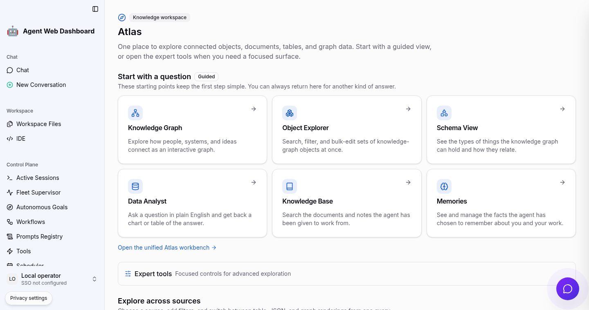

# Agent WebUI

[](https://pypi.org/project/agent-webui/)
[](https://knuckles-team.github.io/agent-webui/)
[](LICENSE)

The browser workspace for governed agents, workflows, and knowledge in GraphOS.



## Overview

Agent WebUI turns GraphOS into an operator-facing product. It provides one React
workspace for agent conversations, approvals, workflows, fleet activity, and
epistemic-graph exploration. Its FastAPI host keeps privileged credentials and
GraphOS delegation on the server side.

| This repository owns | Other components own |
|---|---|
| Browser presentation, local interaction state, accessible route composition, and the WebUI FastAPI boundary | GraphOS owns public routing, identity, policy, and fleet supervision; agent-utilities owns agent behavior; epistemic-graph owns durable knowledge; connector services own external-system effects |

Current package Version: 2.6.1.

## Key Capabilities

- Stream agent responses with sources, governed tool activity, and approval prompts.
- Build and run workflows while observing sessions, goals, schedules, and fleet health.
- Explore property graphs, RDF, schemas, objects, tables, documents, code, and memories through Atlas.
- Discover MCP Apps and connector capabilities without exposing service credentials to the browser.
- Apply one role-aware navigation and server authorization model across the complete workspace.
- Run as the GraphOS-hosted browser co-service or as an independently deployed ASGI application.

## Documentation

Start with the [Agent WebUI documentation](https://knuckles-team.github.io/agent-webui/),
then use the shared platform map to move between components:

| Component | Role | Documentation |
|---|---|---|
| GraphOS | Public MCP, REST, A2A, identity, policy, and runtime composition | [Docs](https://knuckles-team.github.io/graph-os/) |
| agent-utilities | Agent decisions, workflows, evaluation, and skills | [Docs](https://knuckles-team.github.io/agent-utilities/) |
| epistemic-graph | Durable multimodal data, reasoning, provenance, and transactions | [Docs](https://knuckles-team.github.io/epistemic-graph/) |
| agent-connector-sdk | Typed source adapters, connector serving, and write-back contracts | [Docs](https://knuckles-team.github.io/agent-connector-sdk/) |

<details>
<summary>Project telemetry</summary>

[](https://github.com/Knuckles-Team/agent-webui/actions/workflows/release.yml)
[](https://github.com/Knuckles-Team/agent-webui/actions/workflows/advisory.yml)
[](https://pypi.org/project/agent-webui/)
[](https://pypi.org/project/agent-webui/)
[](https://pypi.org/project/agent-webui/)
[](https://pypi.org/project/agent-webui/)
[](https://github.com/Knuckles-Team/agent-webui/stargazers)
[](https://github.com/Knuckles-Team/agent-webui/forks)
[](https://github.com/Knuckles-Team/agent-webui/graphs/contributors)
[](https://github.com/Knuckles-Team/agent-webui/commits/main)
[](https://github.com/Knuckles-Team/agent-webui/pulls)
[](https://github.com/Knuckles-Team/agent-webui/pulls?q=is%3Apr+is%3Aclosed)
[](https://github.com/Knuckles-Team/agent-webui/issues)
[](https://github.com/Knuckles-Team/agent-webui)
[](https://github.com/Knuckles-Team/agent-webui)
[](https://github.com/Knuckles-Team/agent-webui)
[](https://github.com/Knuckles-Team/agent-webui)

</details>

## Architecture


The browser talks only to its same-origin FastAPI host. GraphOS injects the
gateway routes and verified request context before the single-page application
is mounted. The UI renders typed responses and records local presentation state;
it does not become a second authority for policy, knowledge, or connector state.

See the [architecture guide](https://knuckles-team.github.io/agent-webui/architecture/)
for the request flow and trust boundaries.

## Quick Start

Generate a local profile and launch GraphOS with the WebUI integration:

```bash
uvx --from "graph-os[webui]" setup-config generate --profile tiny
export ENABLE_WEB_UI=true
uvx --from "graph-os[webui]" graph-os --transport streamable-http --host 127.0.0.1 --port 8000
```

Open <http://127.0.0.1:8080>. GraphOS serves MCP on port `8000` and the WebUI
co-service on port `8080`. The [start guide](https://knuckles-team.github.io/agent-webui/start/)
covers local source development and deployment profiles.

## Contributing

Issues and pull requests are welcome. Read [AGENTS.md](AGENTS.md), keep browser
and server authority boundaries intact, and run the repository validation suite
before opening a pull request.

## License

Agent WebUI is available under the [MIT License](LICENSE).
