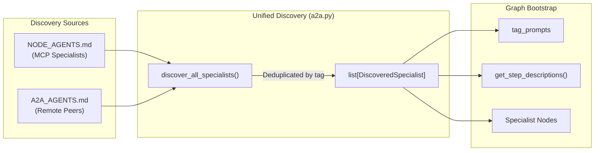

# Agent WebUI


_Version: 0.1.35_

A React-based chat interface for Pydantic AI Agents built using Agent Utilities.

Built with [Vercel AI SDK](https://sdk.vercel.ai/) and designed to work with Pydantic AI's streaming chat API.

## Features

### Core Chat Experience
- Streaming message responses with reasoning display
- Tool call visualization with collapsible input/output
- Interactive Elicitation Forms for structured user input
- Conversation persistence via localStorage and server-side storage
- Dynamic model and tool selection
- Dark/light theme support
- Mobile-responsive sidebar

### Advanced Agent Capabilities
- Scheduling jobs with cron task monitoring
- Memory management with timeline visualization and importance scoring
- MCP Support with unified specialist discovery
- Multi-model support with dynamic routing
- Multi-modal support -- image attachments can be sent alongside text messages for visual reasoning
- Mermaid diagram rendering via [Streamdown](https://github.com/nichochar/streamdown)

### Graph Orchestration & Visualization
- **Graph Activity Visualization** -- real-time specialist tracking with domain routing, parallel execution status, tool calls, and expert reasoning displayed in a collapsible timeline (`GraphActivity.tsx`)
- **Enhanced GraphView** -- interactive graph visualization with:
  - Force-directed, hierarchical, and circular layout algorithms
  - Zoom/pan controls and PNG export
  - Node type filtering and detailed node inspection
  - Real-time graph statistics and relationship explorer
- **Human-in-the-loop tool approval** -- security-sensitive tool calls are intercepted and require explicit user permission via an inline approval card (`ApprovalCard.tsx`)

### Knowledge Management
- **Knowledge Base Management** -- comprehensive KB system with:
  - Document ingestion from multiple sources (PDF, DOCX, EPUB, Markdown, URLs)
  - Article CRUD with concept extraction and fact indexing
  - Health check monitoring with contradiction detection
  - Hybrid search across knowledge bases
- **Memory Management** -- agent memory system with:
  - Timeline visualization of memory creation and updates
  - Importance scoring and temporal decay tracking
  - Tag-based organization and advanced search
  - Impact analysis for code changes
- **MAGMA Orthogonal Views** -- policy-guided retrieval across:
  - Semantic view (vector-based similarity)
  - Temporal view (episodic memory with decay)
  - Causal view (reasoning traces and "why" links)
  - Entity view (people, organizations, code symbols)

### Spec-Driven Development (SDD)
- **Constitution Management** -- project governance and tech stack configuration
- **Specification Management** -- user stories, acceptance criteria, and requirements
- **Implementation Planning** -- technical approach with dependency mapping
- **Task Management** -- parallel execution tracking with status updates
- **Memory Synchronization** -- automatic capture of SDD lifecycle to knowledge graph

### Resource Management
- **MCP Tool Discovery** -- automatic discovery and registration of MCP server tools
- **A2A Agent Registry** -- peer-to-peer agent communication and coordination
- **Specialist Spawning** -- dynamic creation of specialized sub-agents with curated toolsets
- **Resource Explorer** -- unified view of all callable resources (MCP tools, A2A agents, skills)

### Workspace Management
- **Files** -- browse and manage workspace files with upload/download
- **Skills** -- view and configure universal skills
- **Scheduling** -- monitor and manage cron tasks
- **Configuration** -- adjust agent and workspace settings
- **Knowledge** -- manage knowledge base and embeddings
- **Graph** -- interactive knowledge graph visualization and exploration
- **Memory** -- agent memory management with timeline and search
- **SDD** -- spec-driven development lifecycle management

### Agent Identity & Context
- Agent identity display in sidebar with workspace-aware context
- Multi-agent team support with P2P messaging
- Workspace-specific configuration and preferences

## Architecture

### Protocol Support

- **AG-UI (default)**: Standard Vercel AI SDK streaming via `/api/chat`. Supports text, reasoning, tool calls, and graph sideband events. Uses the `@ai-sdk/react` `useChat` hook for real-time streaming.
- **ACP (opt-in)**: Advanced Agent Communication Protocol via `/acp/*`. Provides session management, planning modes, and approval bridges. Enabled by setting `VITE_ENABLE_ACP=true`. Routes through the full HSM graph pipeline via `create_graph_acp_app()`, ensuring ACP clients benefit from specialist routing, parallel execution, circuit breakers, and verification.

### Backend Integration

The backend (`agent/agent_webui/server.py`) creates a FastAPI application via `create_agent_web_app()` that:

1. Mounts Pydantic AI's web routes for `/api/chat` (model selection, tool configuration, streaming)
2. Provides enhanced workspace APIs at `/api/enhanced/*`:
   - **Knowledge Graph APIs**: Memory CRUD, node linking, search, impact analysis, Cypher queries
   - **Knowledge Base APIs**: Ingestion, listing, search, article retrieval, health checks
   - **SDD Lifecycle APIs**: Constitution, specs, plans, tasks management, memory synchronization
   - **MAGMA View APIs**: Orthogonal context retrieval (semantic, temporal, causal, entity)
   - **Resource Management APIs**: MCP/A2A resource listing, specialized agent spawning
   - **Maintenance APIs**: Graph maintenance operations and status monitoring
   - **Pipeline APIs**: 12-phase intelligence pipeline monitoring and execution
3. Serves the built React SPA with client-side routing support via a custom `SPAStaticFiles` handler
4. Integrates Logfire for real-time observability
5. Uses **unified specialist discovery** (`discover_all_specialists()`) at graph bootstrap, merging MCP agents and A2A peers into a single `DiscoveredSpecialist` roster before graph initialization
6. Provides **backend abstraction** via `GraphBackend` factory, supporting LadybugDB (default), FalkorDB, and Neo4j

ACP requests route through the full HSM graph pipeline, ensuring ACP clients share the same specialist routing, parallel execution, and verification logic as AG-UI and SSE clients.

### Unified Discovery Architecture



Both MCP and A2A specialists are registered through the same code path. The frontend does not need to distinguish between them -- it consumes identical sideband events (`specialist_enter`, `tools-bound`, `subagent_completed`) regardless of specialist source.

### Key Frontend Components

| Component                     | File                                         | Responsibility                                                                                            |
| ----------------------------- | -------------------------------------------- | -------------------------------------------------------------------------------------------------------- |
| `Chat.tsx`                    | `src/Chat.tsx`                               | Main chat interface with streaming, tool execution, graph activity, multi-modal input, approval workflows |
| `GraphActivity.tsx`           | `src/components/GraphActivity.tsx`           | Real-time graph execution timeline showing routing decisions, parallel execution, tool binding, and expert reasoning |
| `ApprovalCard.tsx`            | `src/components/ApprovalCard.tsx`            | Human-in-the-loop tool approval card for security-sensitive operations                               |
| `Part.tsx`                    | `src/Part.tsx`                               | Message part renderer handling text, tool calls, elicitation forms, sources, and images              |
| `app-sidebar.tsx`             | `src/components/app-sidebar.tsx`             | Navigation sidebar with conversation history, agent identity, and view switching                     |
| **Graph Views**               |                                              |                                                                                                          |
| `GraphView.tsx`               | `src/components/views/GraphView.tsx`         | Interactive graph visualization with layouts, zoom/pan, node inspection, and statistics                |
| **Knowledge Management**      |                                              |                                                                                                          |
| `KnowledgeBaseView.tsx`       | `src/components/views/KnowledgeBaseView.tsx` | Knowledge base ingestion, article management, health checks, and search                                |
| `MemoryView.tsx`              | `src/components/views/MemoryView.tsx`        | Memory CRUD with timeline visualization, importance scoring, and advanced search                        |
| **SDD Lifecycle**             |                                              |                                                                                                          |
| `SDDView.tsx`                 | `src/components/views/SDDView.tsx`          | Spec-driven development: constitution, specs, plans, tasks, and memory synchronization                  |
| **Workspace Views**            |                                              |                                                                                                          |
| `FilesView.tsx`               | `src/components/views/FilesView.tsx`         | Workspace file browser with upload and download                                                         |
| `SkillsView.tsx`              | `src/components/views/SkillsView.tsx`        | Universal skills viewer and configuration                                                              |
| `SchedulingView.tsx`          | `src/components/views/SchedulingView.tsx`    | Cron task monitoring and management                                                                    |
| `ConfigurationView.tsx`       | `src/components/views/ConfigurationView.tsx` | Agent and workspace configuration                                                                      |
| `KnowledgeView.tsx`           | `src/components/views/KnowledgeView.tsx`     | Knowledge base and embedding management (legacy)                                                      |
| **Protocol Clients**          |                                              |                                                                                                          |
| `acp-client.ts`               | `src/lib/acp-client.ts`                      | ACP protocol client for session management, RPC calls, and SSE event streaming                       |
| `mcp-context.tsx`             | `src/lib/mcp-context.tsx`                    | MCP tool context provider for the React tree                                                            |

### State Management

- **Server state**: React Query (`@tanstack/react-query`) for workspace data, conversations, and configuration
- **Chat state**: Vercel AI SDK `useChat` hook for message streaming and tool execution
- **Client state**: React Context and local component state
- **Persistence**: localStorage for conversation IDs and preferences, server-side via `/api/enhanced/chats`

## Development

```sh
pnpm install
pnpm run dev:server  # start the Python backend (requires agent/ setup)
pnpm run dev         # start the Vite dev server
```

### Testing

```sh
# Frontend tests
pnpm run test              # Run unit tests
pnpm run test:coverage     # Run with coverage
pnpm run test:watch        # Watch mode
pnpm run test:e2e          # Run E2E tests with Playwright

# Backend tests
pytest agent/agent_webui/__tests__/              # Run backend tests
pytest agent/agent_webui/__tests__/ --cov        # With coverage
```

### Environment Variables

| Variable          | Default | Description                                 |
| ----------------- | ------- | ------------------------------------------- |
| `VITE_ENABLE_ACP` | `false` | Enable ACP protocol support alongside AG-UI |

## License

MIT
