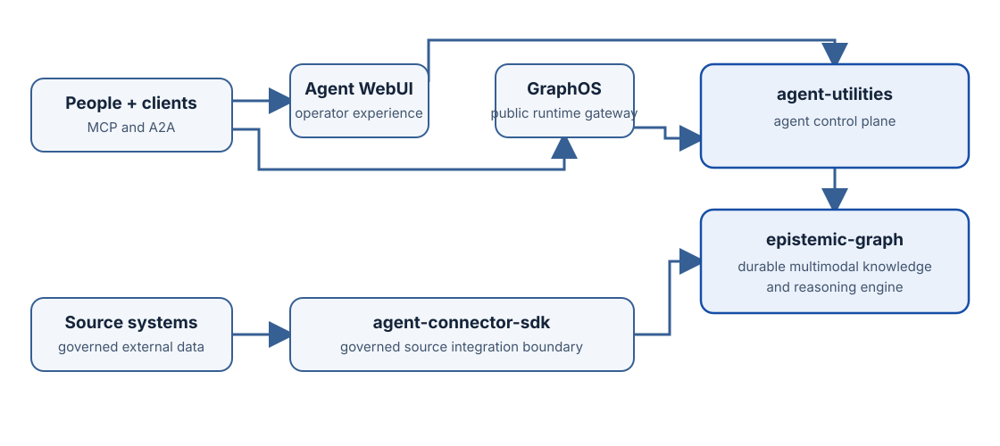

# How the ecosystem fits

The five repositories form one runtime. Each owns one kind of authority, and
Agent WebUI presents those capabilities without duplicating them.

## Component ownership

  <article class="site-card">
    <h3 class="site-card__title">Agent WebUI</h3>
    
The operator experience: browser presentation, local interaction state, accessible navigation, and a same-origin server boundary.

    
<a href="https://knuckles-team.github.io/agent-webui/">Documentation →</a>

  </article>
  <article class="site-card">
    <h3 class="site-card__title">GraphOS</h3>
    
The public runtime gateway: MCP, REST, A2A, identity, policy, fleet supervision, and WebUI composition.

    
<a href="https://knuckles-team.github.io/graph-os/">Documentation →</a>

  </article>
  <article class="site-card">
    <h3 class="site-card__title">agent-utilities</h3>
    
The agent control plane: agent decisions, orchestration, workflows, evaluation, and skills.

    
<a href="https://knuckles-team.github.io/agent-utilities/">Documentation →</a>

  </article>
  <article class="site-card">
    <h3 class="site-card__title">epistemic-graph</h3>
    
The durable multimodal engine: graph, SQL, RDF, vector, time, blobs, reasoning, provenance, and transactions.

    
<a href="https://knuckles-team.github.io/epistemic-graph/">Documentation →</a>

  </article>
  <article class="site-card">
    <h3 class="site-card__title">agent-connector-sdk</h3>
    
The governed source boundary: typed discovery, reads, ingestion records, server registration, and write-back contracts.

    
<a href="https://knuckles-team.github.io/agent-connector-sdk/">Documentation →</a>

  </article>

## One request, one owner at every step

<ol class="site-flow">
  <li class="site-flow__step">
    <h3 class="site-flow__title">Present</h3>
    
Agent WebUI collects the operator's intent and renders typed events and results.

  </li>
  <li class="site-flow__step">
    <h3 class="site-flow__title">Admit</h3>
    
GraphOS verifies identity, applies runtime policy, and selects the owned service boundary.

  </li>
  <li class="site-flow__step">
    <h3 class="site-flow__title">Act</h3>
    
agent-utilities runs agent behavior; connector services perform authorized external effects.

  </li>
  <li class="site-flow__step">
    <h3 class="site-flow__title">Commit</h3>
    
epistemic-graph validates and records durable state, evidence, provenance, and receipts.

  </li>
</ol>

## What the WebUI consumes

| Surface | Authority | WebUI responsibility |
|---|---|---|
| Chat, sessions, goals, workflows, prompts, skills | agent-utilities through GraphOS | Render state, collect input, and surface approvals |
| Graph, RDF, schema, objects, tables, code, documents, memories | epistemic-graph through GraphOS | Provide guided and expert exploration without storing a second truth |
| MCP Apps, connector catalogs, source operations | GraphOS and connector services | Discover typed capabilities and render governed invocation results |
| Identity, roles, request policy, fleet health | GraphOS | Apply the server decision to navigation and interaction controls |

The browser never receives a GraphOS service credential. The WebUI FastAPI host
performs same-origin delegation using the verified request context injected by
GraphOS, and every downstream component remains authoritative only for its own
contract.

## Shared language

Use the [ecosystem glossary](glossary.md) for the canonical meaning of GraphOS,
the agent control plane, the knowledge engine, connector boundary, MCP, A2A,
OWL, RDF, SHACL, and UQL.
